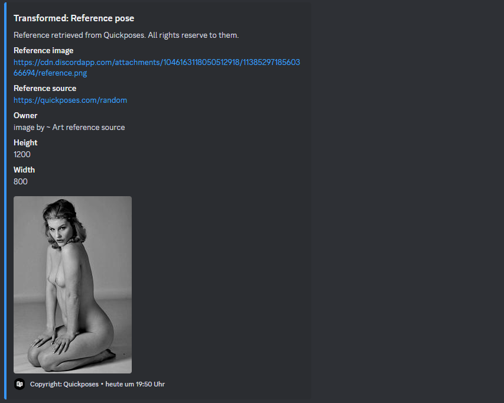

# Phoebe - Discord bot for artists
Discord bot that let artists retrieve reference images in discord from https://quickposes.com.

- Installation:
  -
  
  - Prerequisite:
    
    - Create your own bot application in the discord developer portal: https://discord.com/developers/applications
    - Copy your bot token & your clientId
    - Clone the repo
    - Add an .env file to the root of the project with the attributes:
        - BOTTOKEN='your token'
        - CLIENT_ID='your clientId'
        - If you want to use the bot backend:
          - PORT='the port for the bot backend'
  - Install all dependencies by your own:
  - Install Node.js
  - Run:
   
        npm install 
        npm run start

  - Using the given Dockerfile with following command:
 
          docker build .
- Features:

  - Pose reference retrieval from https://quickposes.com with further information like the owner of the image, the image url and the width and height
  - Image transformation:
    - Under every reference image there are multiple rows of clickable transformation buttons:
      
      Transformation buttons:
      
    
      Original reference:
      
    
    - Rotation (clockwise (:arrows_clockwise: button) and counter-clockwise (:arrows_counterclockwise:)):
      
    - Flip (on y- or x-axis):
      
      Flipped on y-axis (:left_right_arrow: button):
      

      Flipped on x-axis (:arrow_up_down: button):
      

    - Transformation to greyscale image (:older_woman: button):
      
    - Normalization (:grinning: button):
      
    - Median (:heavy_minus_sign: button):
      
    - Sharpening (:razor: button):
      
    - Blur (:dizzy_face: button):
      
    - Negate (:unamused: button):
      

- Available commands:
  - Quickpose commands:
    - /urban => retrieves urban references like skylines
    - /landscapes => retrieves landscape references
    - /face gender(female/male/all) => retrieves face references 
    - /hands gender(female/male/all) => retrieves hand references
    - /animals => retrieves animal references
    - /pose gender(female/male/all) clothing(all/nude & partially nude/clothes & costumes)

- Upcoming features:
    - Reference retrieval via Google image search
    - Reference retrieval via DeviantArt
    - AI generated references
    - Webfrontend

> &copy; 2023 Florian Pfützenreuter
  
